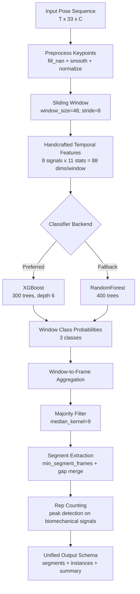

# A-Line Model Structure

## Overview

## Stage-by-Stage Tensor/Feature Shape

- Input pose: `T x 33 x C` (`C>=3`, usually contains `x,y,z,(visibility)`)
- After preprocess: `T x 33 x C`
- Sliding windows: `Nw` windows, each `48 x 33 x C`
- Per-window feature vector: `88`
- Classifier input matrix: `Nw x 88`
- Classifier output probs: `Nw x 3`
- Frame-level aggregation: `T x 3` -> labels `T`
- Final outputs:
  - segments: `[label, start, end, duration, score, source]`
  - instances: repetition-level intervals

## Feature Composition (Per Window)

Signals (8):
- `elbow_l`, `elbow_r`, `arm_span`, `ankle_span`
- `wrist_height`, `hip_height`, `torso_tilt`, `motion_energy`

Stats per signal (11):
- `mean`, `std`, `min`, `max`, `range`, `slope`
- `vel_mean`, `acc_mean`, `ac_lag`, `ac_peak`, `dom_freq`

Total: `8 x 11 = 88` features.

## Source Files

- `src/a_line/pipeline.py`
- `src/features/pose_preprocess.py`
- `src/features/window_features.py`
