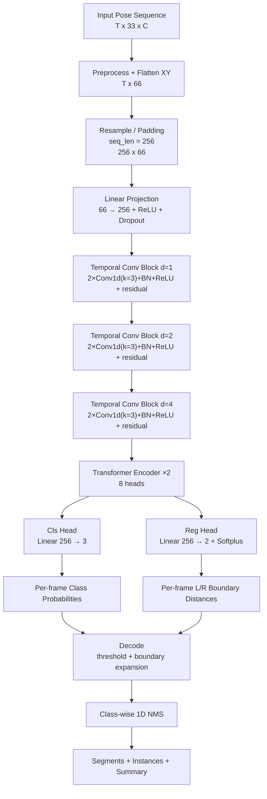

# B-Line Model Structure

## Overview

## Layer Details

Backbone (in order):
1. `Linear(66, 256) + ReLU + Dropout(0.1)`
2. Temporal Conv Stack: 3 residual blocks
   - Each block has **2 Conv1d layers** (`kernel_size=3`) + BN + ReLU
   - Dilations: `1, 2, 4`
   - Total Conv1d layers: **6**
3. `TransformerEncoder` with:
   - `num_layers=2`
   - `nhead=8`
   - `dim_feedforward=1024`

Heads:
- Classification head: `Linear(256, 3)`
- Regression head: `Linear(256, 2)` + `softplus` (predict left/right frame distances)

## Tensor Shapes (Default Config)

- Input pose after flatten: `T x 66`
- Fixed length input: `256 x 66`
- After projection: `256 x 256`
- After conv stack: `256 x 256`
- After transformer: `256 x 256`
- Classification logits: `256 x 3`
- Boundary regression: `256 x 2`

## Training Targets and Loss

Targets per frame:
- Class target: `y_cls in {0,1,2}`
- Boundary target: `y_lr = [left_dist, right_dist]` for positive frames
- Regression mask: positive frames only

Loss:
- `cls_loss = CrossEntropy`
- `reg_loss = SmoothL1`
- `total_loss = cls_loss + reg_loss_weight * reg_loss`

## Source Files

- `src/b_line/full_detector.py`
- `scripts/train_b_line.py`
- `scripts/infer_segments.py`
- `configs/b_line.yaml`
